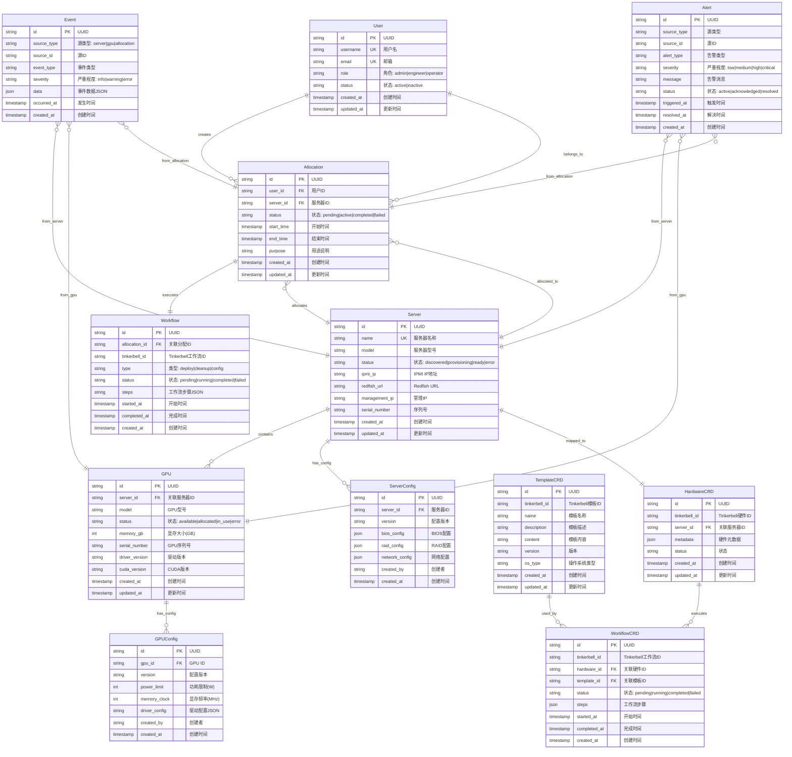
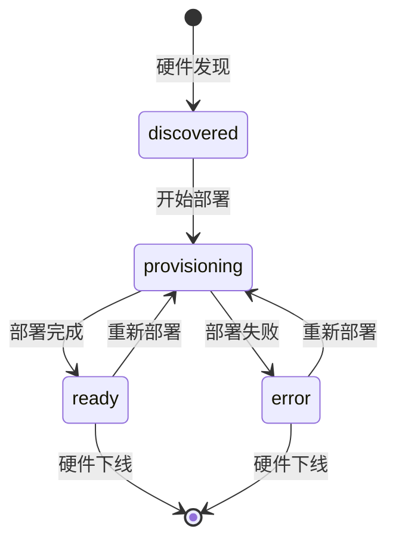
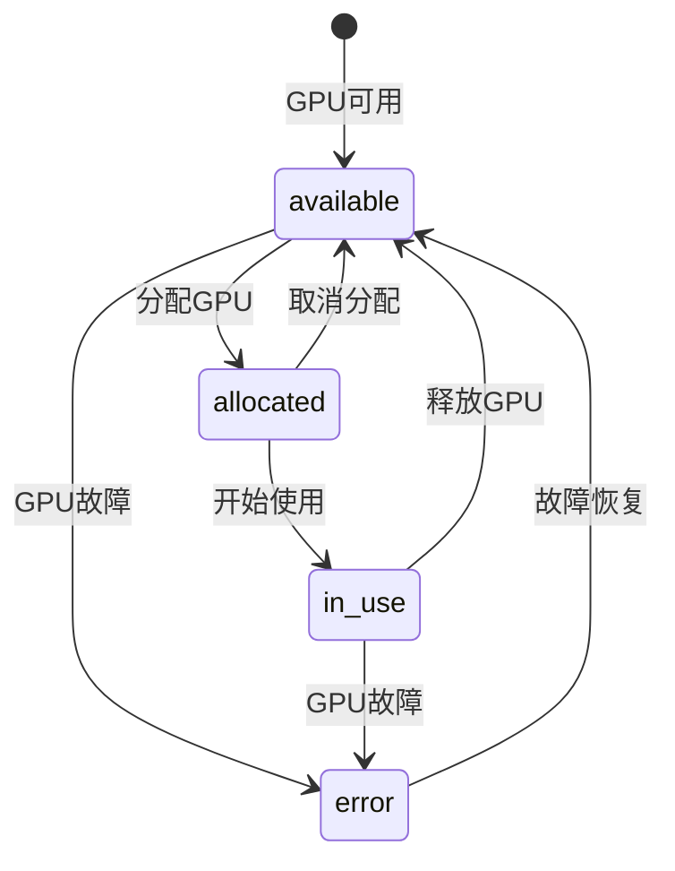
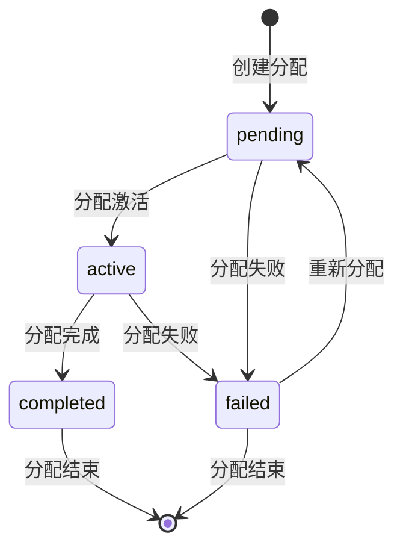
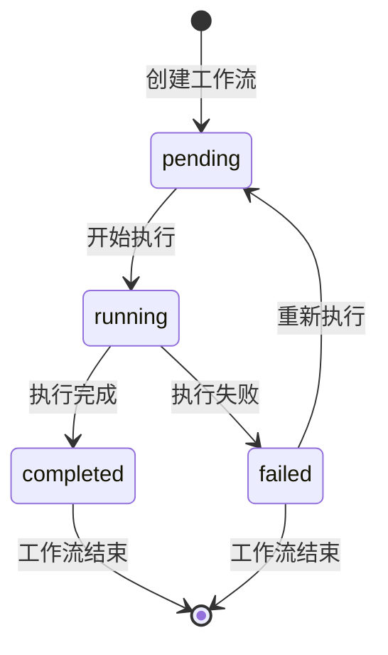
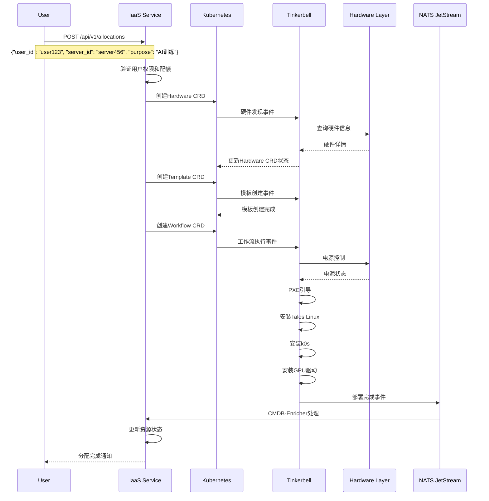
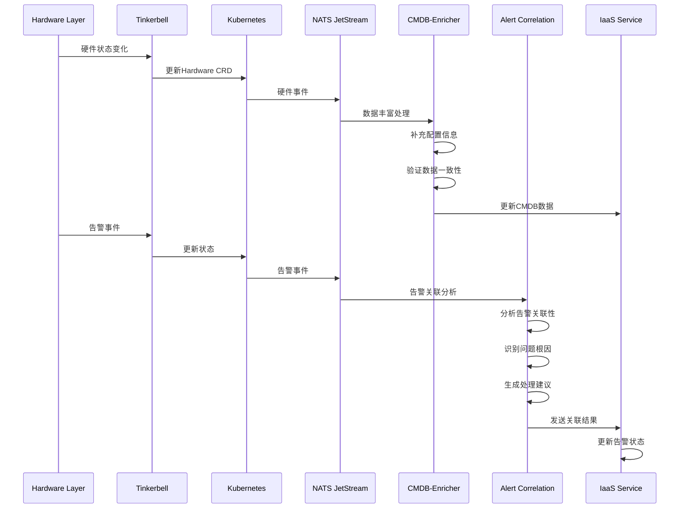
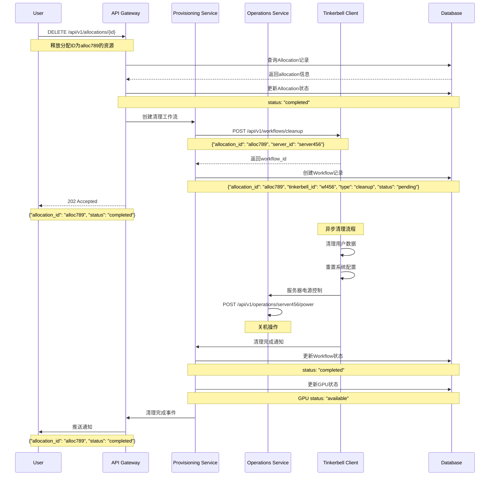
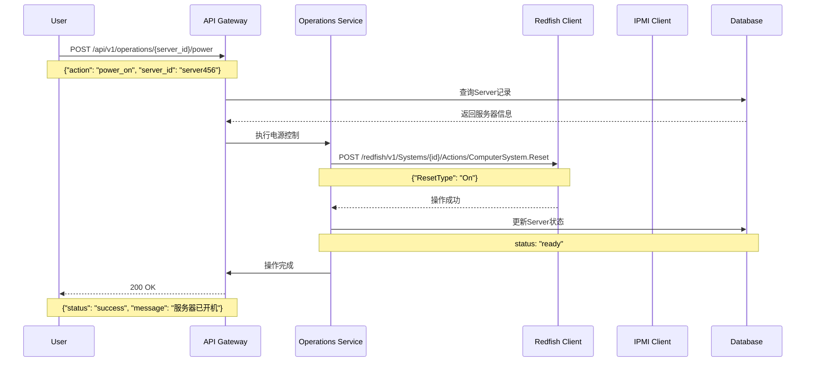
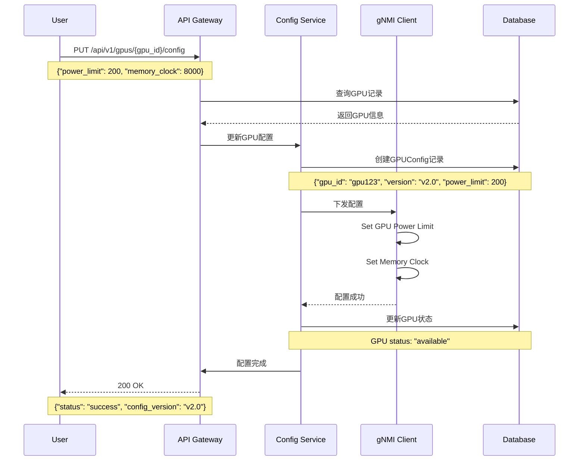

>>> Upated at 2025-08-17 23:00:00 <<<
# GPU资源管理系统架构设计 (修正版本 - 事件驱动架构)

## 文档信息
- **项目名称**: GPU资源管理后台系统
- **版本**: v2.0 (修正版本 - 事件驱动架构)
- **创建日期**: 2025-08-16
- **最后更新**: 2025-08-17 23:00:00
- **负责人**: Architect
- **状态**: 基于评审结果修正完成

## 1. 系统架构概览

### 1.1 架构设计理念
采用**模式A: IaaS作为资源编排层**的架构设计：
- **User → IaaS → K8s → Tinkerbell → Hardware**
- IaaS作为资源编排层，专注于业务逻辑
- K8s作为容器编排平台
- Tinkerbell作为硬件管理核心

### 1.2 技术栈 (基于JD要求)
- **主要语言**: Golang (核心微服务)
- **辅助语言**: Python (工具开发)
- **Web框架**: Echo v4.11.4 (MVP选定)
- **容器编排**: Kubernetes (k0s)
- **硬件管理**: Tinkerbell v0.12.2
- **操作系统**: Talos Linux
- **配置管理**: Cloud-init
- **数据存储**: PostgreSQL + Redis + InfluxDB
- **消息队列**: NATS JetStream (MVP) / Kafka (生产环境)
- **API接口**: REST (MVP) + gRPC/GraphQL (P1)
- **测试框架**: Testcontainers-Go + k8s

**框架选择说明**: 
经过详细的技术选型分析，MVP阶段选定Echo v4.11.4作为Web框架。选择理由包括：
- 性能优异：零内存分配路由，高并发处理能力
- 功能完整：中间件系统强大，错误处理完善
- 生态丰富：gRPC、GraphQL支持完善
- 架构契合：完美支持事件驱动架构
- 团队友好：与团队现有Gin经验兼容，学习成本低
- 企业级特性：生产就绪，文档质量高，版本稳定

详细分析请参考：`docs/analysis/echo-framework-selection-analysis.md`

### 1.3 架构模式 (修正版本)
```
┌─────────────────────────────────────────────────────────────┐
│                   应用层 (Application Layer)                │
│  ┌─────────────┐ ┌─────────────┐ ┌─────────────┐           │
│  │  用户界面   │ │  API网关    │ │  IaaS服务   │           │
│  │             │ │             │ │             │           │
│  └─────────────┘ └─────────────┘ └─────────────┘           │
└─────────────────────────────────────────────────────────────┘
                                │
┌─────────────────────────────────────────────────────────────┐
│                  编排层 (Orchestration Layer)               │
│  ┌─────────────┐ ┌─────────────┐ ┌─────────────┐           │
│  │ Kubernetes  │ │ Tinkerbell  │ │   CRD资源   │           │
│  │   (k0s)     │ │             │ │             │           │
│  └─────────────┘ └─────────────┘ └─────────────┘           │
└─────────────────────────────────────────────────────────────┘
                                │
┌─────────────────────────────────────────────────────────────┐
│                  硬件层 (Hardware Layer)                    │
│  ┌─────────────┐ ┌─────────────┐ ┌─────────────┐           │
│  │   IPMI      │ │  Redfish    │ │   gNMI      │           │
│  │   协议      │ │   协议      │ │   协议      │           │
│  └─────────────┘ └─────────────┘ └─────────────┘           │
└─────────────────────────────────────────────────────────────┘
                                │
┌─────────────────────────────────────────────────────────────┐
│               基础设施层 (Infrastructure Layer)             │
│  ┌─────────────┐ ┌─────────────┐ ┌─────────────┐           │
│  │ Talos Linux │ │    k0s      │ │ Cloud-init  │           │
│  │             │ │   集群      │ │             │           │
│  └─────────────┘ └─────────────┘ └─────────────┘           │
└─────────────────────────────────────────────────────────────┘
```

## 2. 实体关系图 (ERD) - 详细设计

### 2.1 完整ERD设计



### 2.2 约束关系说明

#### **主键约束 (PK)**
```sql
-- 所有实体的主键都是UUID类型
User.id PK
Server.id PK
GPU.id PK
Allocation.id PK
Workflow.id PK
ServerConfig.id PK
GPUConfig.id PK
Event.id PK
Alert.id PK
```

#### **外键约束 (FK)**
```sql
-- GPU必须属于某个服务器
GPU.server_id FK → Server.id

-- 分配必须关联用户和服务器
Allocation.user_id FK → User.id
Allocation.server_id FK → Server.id

-- 工作流必须关联分配
Workflow.allocation_id FK → Allocation.id

-- 配置必须关联对应资源
ServerConfig.server_id FK → Server.id
GPUConfig.gpu_id FK → GPU.id
```

#### **唯一约束 (UK)**
```sql
-- 用户名和邮箱唯一
User.username UK
User.email UK

-- 服务器名称唯一
Server.name UK

-- 配置版本唯一（同一资源）
ServerConfig(server_id, version) UK
GPUConfig(gpu_id, version) UK
```

#### **业务约束**
```sql
-- 状态约束
Server.status IN ('discovered', 'provisioning', 'ready', 'error')
GPU.status IN ('available', 'allocated', 'in_use', 'error')
Allocation.status IN ('pending', 'active', 'completed', 'failed')
Workflow.status IN ('pending', 'running', 'completed', 'failed')

-- 时间约束
Allocation.end_time > Allocation.start_time
Workflow.completed_at >= Workflow.started_at

-- 资源约束
GPU.memory_gb > 0
GPUConfig.power_limit > 0
```

### 2.3 业务流程状态机

#### **服务器生命周期状态机**


#### **GPU资源状态机**


#### **分配状态机**


#### **工作流状态机**


### 2.2 约束关系说明

#### **主键约束 (PK)**
```sql
-- 所有实体的主键都是UUID类型
User.id PK
Server.id PK
GPU.id PK
Allocation.id PK
Workflow.id PK
ServerConfig.id PK
GPUConfig.id PK
Event.id PK
Alert.id PK
```

#### **外键约束 (FK)**
```sql
-- GPU必须属于某个服务器
GPU.server_id FK → Server.id

-- 分配必须关联用户和服务器
Allocation.user_id FK → User.id
Allocation.server_id FK → Server.id

-- 工作流必须关联分配
Workflow.allocation_id FK → Allocation.id

-- 配置必须关联对应资源
ServerConfig.server_id FK → Server.id
GPUConfig.gpu_id FK → GPU.id
```

#### **唯一约束 (UK)**
```sql
-- 用户名和邮箱唯一
User.username UK
User.email UK

-- 服务器名称唯一
Server.name UK

-- 配置版本唯一（同一资源）
ServerConfig(server_id, version) UK
GPUConfig(gpu_id, version) UK
```

#### **业务约束**
```sql
-- 状态约束
Server.status IN ('discovered', 'provisioning', 'ready', 'error')
GPU.status IN ('available', 'allocated', 'in_use', 'error')
Allocation.status IN ('pending', 'active', 'completed', 'failed')
Workflow.status IN ('pending', 'running', 'completed', 'failed')

-- 时间约束
Allocation.end_time > Allocation.start_time
Workflow.completed_at >= Workflow.started_at

-- 资源约束
GPU.memory_gb > 0
GPUConfig.power_limit > 0
```

### 2.3 业务流程状态机

#### **服务器生命周期状态机**


#### **GPU资源状态机**


#### **分配状态机**


#### **工作流状态机**


## 3. 核心流程时序图 - 基于API设计

### 3.1 GPU资源分配流程 (修正版本)



### 3.2 事件驱动架构流程



### 3.2 GPU资源释放流程



### 3.3 服务器硬件管理流程



### 3.4 GPU配置管理流程



## 4. 核心服务设计

### Provisioning Service
```go
type ProvisioningService interface {
    DeployGPUEnvironment(req *DeployRequest) (*DeployResult, error)
    GetDeployStatus(deployID string) (*DeployStatus, error)
    CancelDeploy(deployID string) error
    ValidateEnvironment(serverID string) (*ValidationResult, error)
}
```

### Operations Service
```go
type OperationsService interface {
    ListServers() ([]*Server, error)
    PowerControl(serverID string, action PowerAction) error
    ConfigureHardware(serverID string, config *HardwareConfig) error
    UpgradeFirmware(serverID string, firmware *FirmwareInfo) error
    GetServerStatus(serverID string) (*ServerStatus, error)
}
```

### CMDB Service
```go
type CMDBService interface {
    CreateAsset(asset *Asset) error
    UpdateAsset(assetID string, asset *Asset) error
    GetAsset(assetID string) (*Asset, error)
    ListAssets(filter *AssetFilter) ([]*Asset, error)
    GetAssetVersions(assetID string) ([]*AssetVersion, error)
    TrackConfigurationChange(assetID string, change *ConfigChange) error
}
```

### EventStream Service
```go
type EventStreamService interface {
    PublishEvent(event *Event) error
    SubscribeEvents(topic string, handler EventHandler) error
    GetEvents(filter *EventFilter) ([]*Event, error)
    ProcessAlertCorrelation(alert *Alert) (*CorrelationResult, error)
}
```

### CMDB-Enricher Service

```go
type CMDBEnricherService interface {
    HandleHardwareDiscovered(event *HardwareEvent) error
    EnrichHardwareData(hardwareID string) error
    ValidateConfiguration(config *HardwareConfig) (*ValidationResult, error)
    UpdateCMDBData(hardwareID string, data *EnrichedData) error
}
```

### Alert Correlation Service
```go
type AlertCorrelationService interface {
    HandleAlert(alert *Alert) error
    CorrelateAlerts(alerts []*Alert) (*CorrelationResult, error)
    AnalyzeRootCause(correlation *CorrelationResult) (*RootCauseAnalysis, error)
    GenerateRecommendation(analysis *RootCauseAnalysis) (*Recommendation, error)
}
```

## 5. API设计

### API设计 (MVP版本)

#### REST API (MVP优先级) - 基于数据层设计
```go
// 用户管理
GET    /api/v1/users                  // 查询用户列表
POST   /api/v1/users                  // 创建用户
GET    /api/v1/users/{id}             // 查询用户详情
PUT    /api/v1/users/{id}             // 更新用户信息
GET    /api/v1/users/{id}/allocations // 查询用户分配

// 服务器管理
GET    /api/v1/servers                // 查询服务器列表
POST   /api/v1/servers                // 创建服务器记录
GET    /api/v1/servers/{id}           // 查询服务器详情
PUT    /api/v1/servers/{id}           // 更新服务器信息
DELETE /api/v1/servers/{id}           // 删除服务器记录

// 服务器硬件操作 (基于Redfish/IPMI)
POST   /api/v1/servers/{id}/power     // 电源控制: {"action": "power_on|power_off|reboot"}
GET    /api/v1/servers/{id}/status    // 查询硬件状态
POST   /api/v1/servers/{id}/bios      // BIOS配置
POST   /api/v1/servers/{id}/firmware  // 固件升级

// 服务器GPU管理
GET    /api/v1/servers/{id}/gpus      // 查询服务器的GPU
POST   /api/v1/servers/{id}/gpus      // 添加GPU到服务器

// 服务器配置管理
GET    /api/v1/servers/{id}/config    // 查询服务器配置
PUT    /api/v1/servers/{id}/config    // 更新服务器配置
GET    /api/v1/servers/{id}/config/versions // 查询配置版本

// GPU资源管理
GET    /api/v1/gpus                   // 查询GPU列表
GET    /api/v1/gpus/{id}              // 查询GPU详情
PUT    /api/v1/gpus/{id}              // 更新GPU信息

// GPU硬件操作 (基于gNMI)
GET    /api/v1/gpus/{id}/status       // 查询GPU状态
GET    /api/v1/gpus/{id}/metrics      // 查询GPU指标
POST   /api/v1/gpus/{id}/config       // GPU配置管理

// GPU配置管理
GET    /api/v1/gpus/{id}/config       // 查询GPU配置
PUT    /api/v1/gpus/{id}/config       // 更新GPU配置
GET    /api/v1/gpus/{id}/config/versions // 查询配置版本

// 资源分配管理
GET    /api/v1/allocations            // 查询分配列表
POST   /api/v1/allocations            // 创建资源分配: {"user_id": "user123", "server_id": "server456", "purpose": "AI训练"}
GET    /api/v1/allocations/{id}       // 查询分配详情
PUT    /api/v1/allocations/{id}       // 更新分配状态
DELETE /api/v1/allocations/{id}       // 释放资源分配

// 分配状态管理
POST   /api/v1/allocations/{id}/start // 启动分配
POST   /api/v1/allocations/{id}/stop  // 停止分配
GET    /api/v1/allocations/{id}/status // 查询分配状态

// 工作流管理 (基于Tinkerbell)
GET    /api/v1/workflows              // 查询工作流列表
POST   /api/v1/workflows              // 创建工作流
GET    /api/v1/workflows/{id}         // 查询工作流状态
DELETE /api/v1/workflows/{id}         // 取消工作流

// 部署工作流
POST   /api/v1/workflows/deploy       // 创建部署工作流: {"allocation_id": "alloc789", "server_id": "server456"}
POST   /api/v1/workflows/cleanup      // 创建清理工作流: {"allocation_id": "alloc789", "server_id": "server456"}

// 事件管理
GET    /api/v1/events                 // 查询事件列表
POST   /api/v1/events                 // 发送事件
GET    /api/v1/events/{id}            // 查询事件详情

// 告警管理
GET    /api/v1/alerts                 // 查询告警列表
POST   /api/v1/alerts                 // 创建告警
PUT    /api/v1/alerts/{id}            // 更新告警状态
GET    /api/v1/alerts/{id}/correlation // 告警关联分析
```

#### gRPC/GraphQL API (P1优先级)
```go
// gRPC服务定义
service GPUManagement {
    rpc AllocateGPU(AllocateRequest) returns (AllocateResponse);
    rpc ReleaseGPU(ReleaseRequest) returns (ReleaseResponse);
    rpc GetGPUStatus(StatusRequest) returns (StatusResponse);
}

// GraphQL Schema
type Query {
    gpus: [GPU]
    servers: [Server]
    assets: [Asset]
}
```

## 6. 数据模型

### 核心模型 (MVP版本) - 基于ERD设计
```go
type User struct {
    ID        string    `json:"id" db:"id"`
    Username  string    `json:"username" db:"username"`
    Email     string    `json:"email" db:"email"`
    Role      string    `json:"role" db:"role"`
    Status    string    `json:"status" db:"status"`
    CreatedAt time.Time `json:"created_at" db:"created_at"`
    UpdatedAt time.Time `json:"updated_at" db:"updated_at"`
}

type Server struct {
    ID             string    `json:"id" db:"id"`
    Name           string    `json:"name" db:"name"`
    Model          string    `json:"model" db:"model"`
    Status         string    `json:"status" db:"status"`
    IPMIIP         string    `json:"ipmi_ip" db:"ipmi_ip"`
    RedfishURL     string    `json:"redfish_url" db:"redfish_url"`
    ManagementIP   string    `json:"management_ip" db:"management_ip"`
    SerialNumber   string    `json:"serial_number" db:"serial_number"`
    CreatedAt      time.Time `json:"created_at" db:"created_at"`
    UpdatedAt      time.Time `json:"updated_at" db:"updated_at"`
}

type GPU struct {
    ID            string    `json:"id" db:"id"`
    ServerID      string    `json:"server_id" db:"server_id"`
    Model         string    `json:"model" db:"model"`
    Status        string    `json:"status" db:"status"`
    MemoryGB      int       `json:"memory_gb" db:"memory_gb"`
    SerialNumber  string    `json:"serial_number" db:"serial_number"`
    DriverVersion string    `json:"driver_version" db:"driver_version"`
    CUDAVersion   string    `json:"cuda_version" db:"cuda_version"`
    CreatedAt     time.Time `json:"created_at" db:"created_at"`
    UpdatedAt     time.Time `json:"updated_at" db:"updated_at"`
}

type Allocation struct {
    ID        string     `json:"id" db:"id"`
    UserID    string     `json:"user_id" db:"user_id"`
    ServerID  string     `json:"server_id" db:"server_id"`
    Status    string     `json:"status" db:"status"`
    StartTime *time.Time `json:"start_time" db:"start_time"`
    EndTime   *time.Time `json:"end_time" db:"end_time"`
    Purpose   string     `json:"purpose" db:"purpose"`
    CreatedAt time.Time  `json:"created_at" db:"created_at"`
    UpdatedAt time.Time  `json:"updated_at" db:"updated_at"`
}

type Workflow struct {
    ID            string     `json:"id" db:"id"`
    AllocationID  string     `json:"allocation_id" db:"allocation_id"`
    TinkerbellID  string     `json:"tinkerbell_id" db:"tinkerbell_id"`
    Type          string     `json:"type" db:"type"`
    Status        string     `json:"status" db:"status"`
    Steps         string     `json:"steps" db:"steps"`
    StartedAt     *time.Time `json:"started_at" db:"started_at"`
    CompletedAt   *time.Time `json:"completed_at" db:"completed_at"`
    CreatedAt     time.Time  `json:"created_at" db:"created_at"`
}

type ServerConfig struct {
    ID            string            `json:"id" db:"id"`
    ServerID      string            `json:"server_id" db:"server_id"`
    Version       string            `json:"version" db:"version"`
    BIOSConfig    map[string]string `json:"bios_config" db:"bios_config"`
    RAIDConfig    map[string]string `json:"raid_config" db:"raid_config"`
    NetworkConfig map[string]string `json:"network_config" db:"network_config"`
    CreatedBy     string            `json:"created_by" db:"created_by"`
    CreatedAt     time.Time         `json:"created_at" db:"created_at"`
}

type GPUConfig struct {
    ID           string            `json:"id" db:"id"`
    GPUID        string            `json:"gpu_id" db:"gpu_id"`
    Version      string            `json:"version" db:"version"`
    PowerLimit   int               `json:"power_limit" db:"power_limit"`
    MemoryClock  int               `json:"memory_clock" db:"memory_clock"`
    DriverConfig map[string]string `json:"driver_config" db:"driver_config"`
    CreatedBy    string            `json:"created_by" db:"created_by"`
    CreatedAt    time.Time         `json:"created_at" db:"created_at"`
}

type Event struct {
    ID         string            `json:"id" db:"id"`
    SourceType string            `json:"source_type" db:"source_type"`
    SourceID   string            `json:"source_id" db:"source_id"`
    EventType  string            `json:"event_type" db:"event_type"`
    Severity   string            `json:"severity" db:"severity"`
    Data       map[string]string `json:"data" db:"data"`
    OccurredAt time.Time         `json:"occurred_at" db:"occurred_at"`
    CreatedAt  time.Time         `json:"created_at" db:"created_at"`
}

type Alert struct {
    ID          string     `json:"id" db:"id"`
    SourceType  string     `json:"source_type" db:"source_type"`
    SourceID    string     `json:"source_id" db:"source_id"`
    AlertType   string     `json:"alert_type" db:"alert_type"`
    Severity    string     `json:"severity" db:"severity"`
    Message     string     `json:"message" db:"message"`
    Status      string     `json:"status" db:"status"`
    TriggeredAt time.Time  `json:"triggered_at" db:"triggered_at"`
    ResolvedAt  *time.Time `json:"resolved_at" db:"resolved_at"`
    CreatedAt   time.Time  `json:"created_at" db:"created_at"`
}
```

## 7. 部署架构

### 容器化部署
```yaml
# docker-compose.yml
version: '3.8'
services:
  app:
    build: .
    ports:
      - "8080:8080"
    depends_on:
      - postgres
      - redis
      - nats
  
  postgres:
    image: postgres:15
    environment:
      POSTGRES_DB: gpu_management
  
  redis:
    image: redis:7-alpine
  
  nats:
    image: nats:2.9
```

## 8. 开发计划 (MVP版本)

### 第一阶段 (1周): 项目搭建
- 生成项目结构
- 搭建基础框架
- 配置开发环境
- 搭建测试环境 (Testcontainers-Go + k8s)

### 第二阶段 (1-2周): 核心微服务
- 开发Provisioning服务 (Tinkerbell集成)
- 开发Operations服务 (Redfish/IPMI/gNMI)
- 开发CMDB服务 (资产版本管理)
- 开发事件流服务 (NATS JetStream)

### 第三阶段 (1周): API接口和工具
- 开发REST API (MVP优先级)
- 开发Python工具 (模拟器、脚本、Stub)
- 编写单元测试和集成测试
- 性能优化

### 第四阶段 (1周): 测试和文档
- 压力测试和稳定性测试
- API文档完善
- 开发文档完善
- 部署文档完善

### P1功能开发 (后续版本)
- 开发gRPC API
- 开发GraphQL API
- 高级功能优化

## 9. 质量保证

### 测试策略
- **单元测试**: 核心业务逻辑
- **集成测试**: 服务间集成
- **端到端测试**: 完整业务流程
- **性能测试**: 负载测试

### 监控告警
- **应用监控**: Prometheus + Grafana
- **日志管理**: ELK Stack
- **告警通知**: 邮件/SMS

## 10. 总结 (MVP版本)

这个架构设计基于JD要求，聚焦MVP版本，提供了：
- **核心微服务**: Provisioning、Operations、CMDB、EventStream
- **技术栈匹配**: Golang + Python + Tinkerbell + NATS
- **API优先级**: REST (MVP) + gRPC/GraphQL (P1)
- **测试框架**: Testcontainers-Go + k8s
- **开发工具**: Python模拟器、脚本、测试Stub
- **AI辅助开发**: 4-6周完成MVP

### 与JD要求的对应关系
1. ✅ **微服务开发**: Provisioning、Operations、CMDB
2. ✅ **硬件驱动**: Redfish/IPMI/gNMI支持
3. ✅ **数据模型**: PostgreSQL/Redis/InfluxDB
4. ✅ **事件流**: NATS JetStream + CMDB-Enricher
5. ✅ **API接口**: REST (MVP) + gRPC/GraphQL (P1)
6. ✅ **Python工具**: 模拟器、脚本、测试Stub
7. ✅ **测试框架**: Testcontainers-Go + k8s
