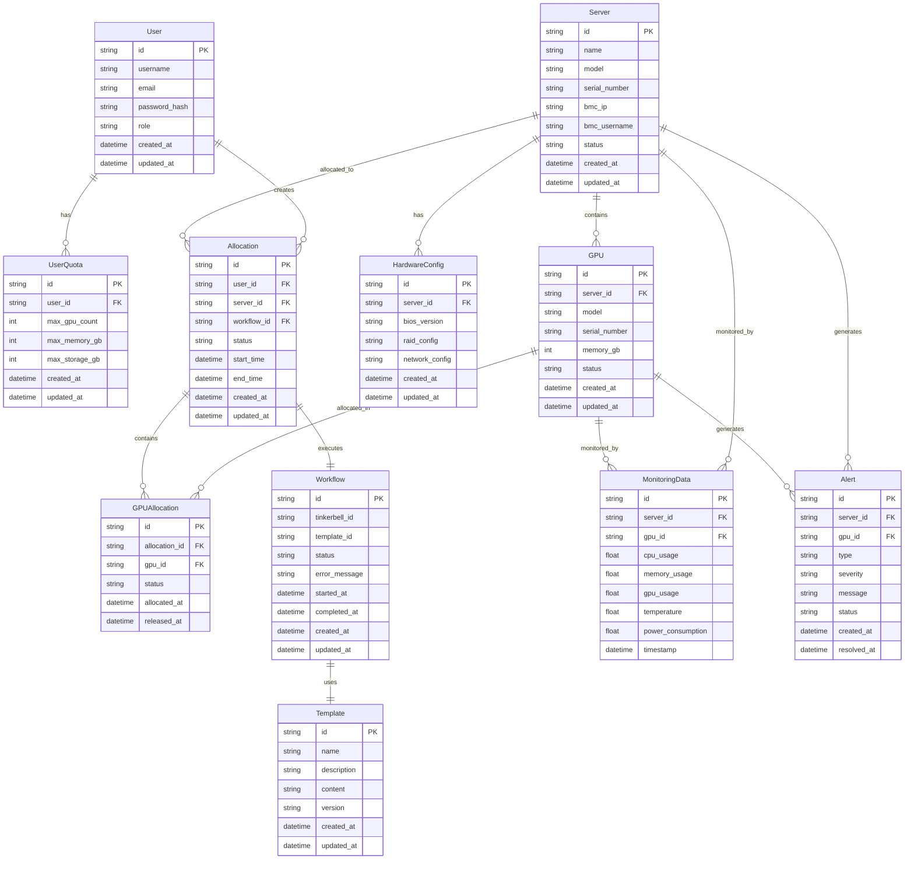
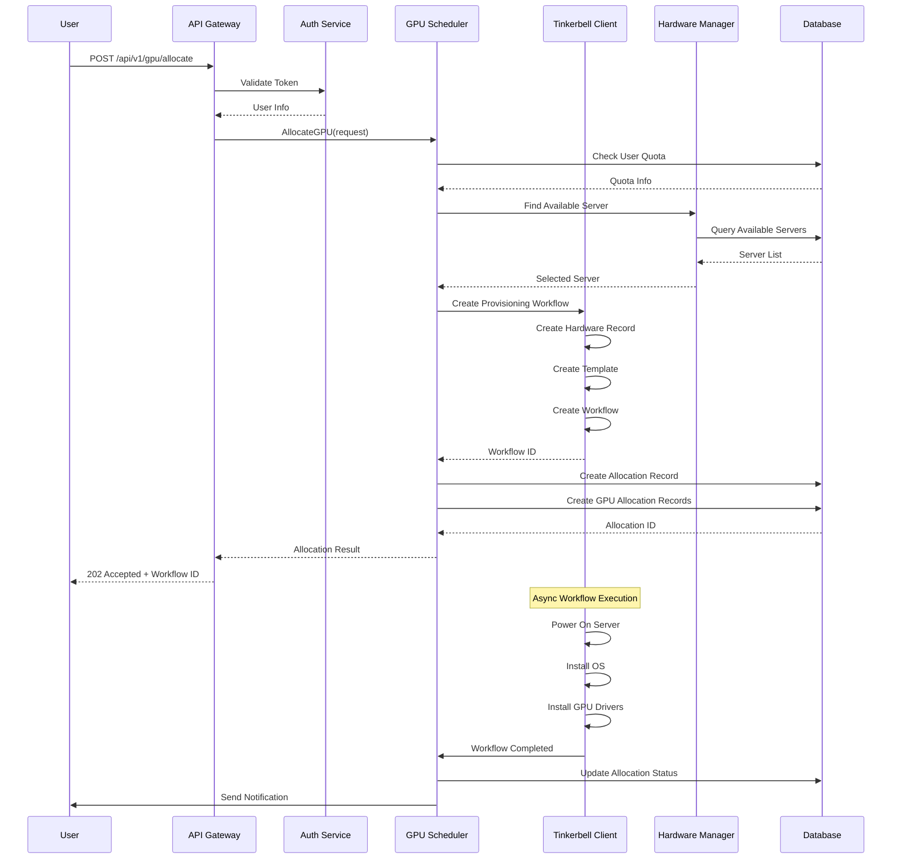
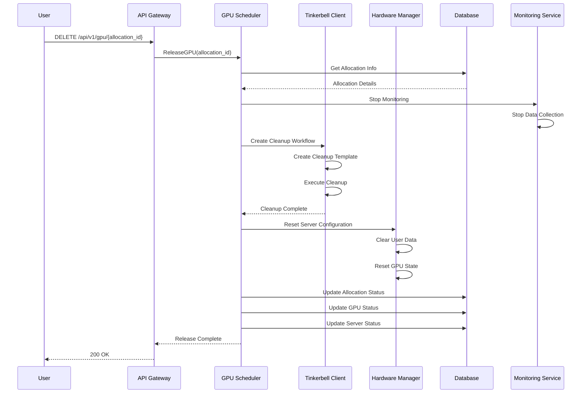
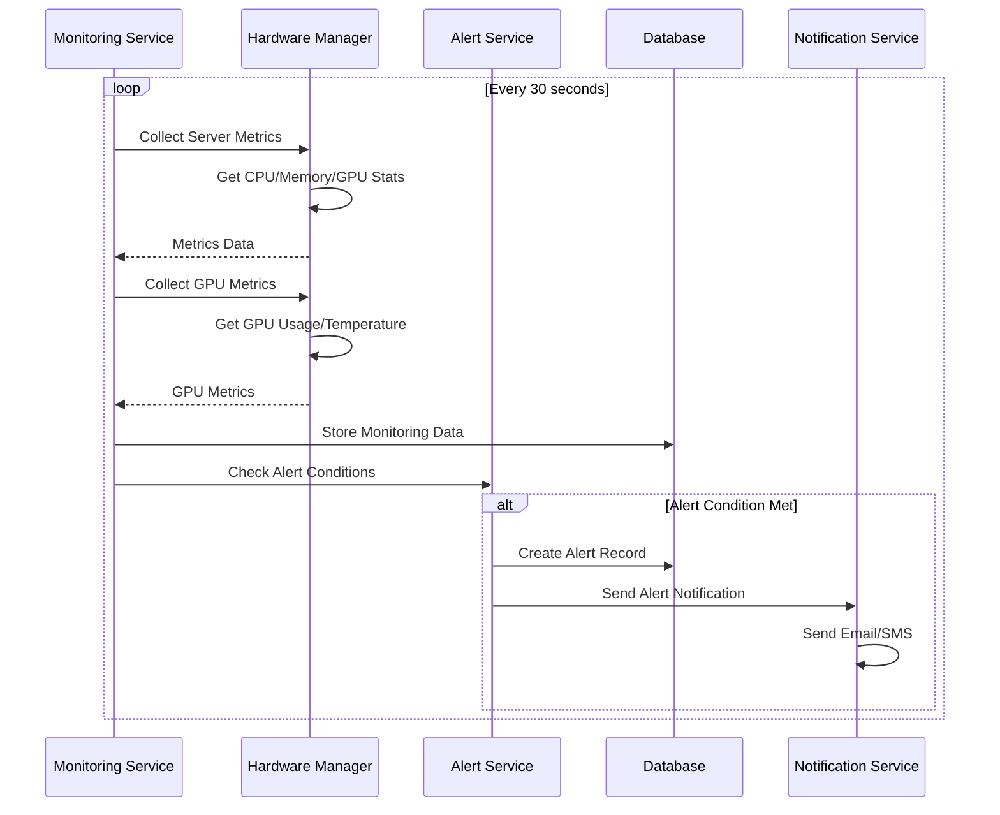

# GPU资源管理系统架构设计文档

## 文档信息
- **项目名称**: GPU资源管理后台系统
- **版本**: v1.0
- **创建日期**: 2025-08-16
- **负责人**: Architect
- **状态**: 架构设计完成

## 1. 设计概述

### 1.1 设计目标
构建一个企业级GPU基础设施管理平台，实现：
- GPU资源的全生命周期管理
- 多用户GPU资源共享
- 自动化硬件管理和配置
- 高性能、高可用的系统架构

### 1.2 设计约束
- **技术栈**: Golang为主，Python、Shell为辅
- **许可证**: Apache 2.0开源组件
- **硬件管理**: 支持Redfish、IPMI、gNMI协议
- **性能要求**: GPU分配响应时间 ≤ 5分钟
- **可用性**: 系统可用性 ≥ 99%

### 1.3 架构风格
采用**微服务架构 + 事件驱动**的设计风格：
- **微服务**: 高内聚、低耦合的服务设计
- **事件驱动**: 异步事件处理，提高系统响应性
- **分层设计**: 清晰的分层架构，职责明确

## 2. 系统架构

### 2.1 整体架构
```
┌─────────────────────────────────────────────────────────────┐
│                    API Gateway Layer                        │
├─────────────────────────────────────────────────────────────┤
│                 Business Service Layer                      │
│  ┌─────────────┐ ┌─────────────┐ ┌─────────────┐ ┌─────────┐ │
│  │ GPU Service │ │ Scheduler   │ │ Hardware    │ │ User    │ │
│  │             │ │ Service     │ │ Service     │ │ Service │ │
│  └─────────────┘ └─────────────┘ └─────────────┘ └─────────┘ │
├─────────────────────────────────────────────────────────────┤
│                  Integration Layer                          │
│  ┌─────────────┐ ┌─────────────┐ ┌─────────────┐ ┌─────────┐ │
│  │ Tinkerbell  │ │ Monitoring  │ │ Message     │ │ Storage │ │
│  │ Integration │ │ Integration │ │ Queue       │ │ Layer   │ │
│  └─────────────┘ └─────────────┘ └─────────────┘ └─────────┘ │
├─────────────────────────────────────────────────────────────┤
│                 Infrastructure Layer                        │
│  ┌─────────────┐ ┌─────────────┐ ┌─────────────┐ ┌─────────┐ │
│  │ PostgreSQL  │ │ Redis       │ │ InfluxDB    │ │ NATS    │ │
│  │ (主数据库)   │ │ (缓存)      │ │ (时序数据)   │ │ (消息)  │ │
│  └─────────────┘ └─────────────┘ └─────────────┘ └─────────┘ │
└─────────────────────────────────────────────────────────────┘
```

### 2.2 分层设计

#### **API Gateway Layer**
- **职责**: 统一API入口、认证授权、限流熔断
- **技术**: Echo/Fiber + 中间件
- **组件**: 路由、认证、限流、日志中间件

#### **Business Service Layer**
- **GPU Service**: GPU资源管理核心逻辑
- **Scheduler Service**: 资源调度和分配
- **Hardware Service**: 硬件管理和配置
- **User Service**: 用户管理和权限控制

#### **Integration Layer**
- **Tinkerbell Integration**: 裸金属provisioning集成
- **Monitoring Integration**: 监控和告警集成
- **Message Queue**: 事件流处理
- **Storage Layer**: 数据存储抽象

#### **Infrastructure Layer**
- **PostgreSQL**: 关系型数据存储
- **Redis**: 缓存和会话管理
- **InfluxDB**: 时序数据存储
- **NATS**: 消息队列和事件流

### 2.3 模块设计

#### **核心模块关系**
```
GPU Service ←→ Scheduler Service ←→ Hardware Service
     ↓              ↓                    ↓
Tinkerbell Integration ←→ Message Queue ←→ Storage Layer
     ↓              ↓                    ↓
Monitoring Integration ←→ Event Processing ←→ Data Persistence
```

## 3. 数据架构设计

### 3.1 实体关系图 (ERD)



### 3.2 数据模型设计

#### **核心数据模型**
```go
// 用户模型
type User struct {
    ID           string    `json:"id" db:"id"`
    Username     string    `json:"username" db:"username"`
    Email        string    `json:"email" db:"email"`
    PasswordHash string    `json:"-" db:"password_hash"`
    Role         string    `json:"role" db:"role"`
    CreatedAt    time.Time `json:"created_at" db:"created_at"`
    UpdatedAt    time.Time `json:"updated_at" db:"updated_at"`
}

// 服务器模型
type Server struct {
    ID           string    `json:"id" db:"id"`
    Name         string    `json:"name" db:"name"`
    Model        string    `json:"model" db:"model"`
    SerialNumber string    `json:"serial_number" db:"serial_number"`
    BMCIP        string    `json:"bmc_ip" db:"bmc_ip"`
    BMCUsername  string    `json:"bmc_username" db:"bmc_username"`
    Status       string    `json:"status" db:"status"`
    CreatedAt    time.Time `json:"created_at" db:"created_at"`
    UpdatedAt    time.Time `json:"updated_at" db:"updated_at"`
}

// GPU模型
type GPU struct {
    ID           string    `json:"id" db:"id"`
    ServerID     string    `json:"server_id" db:"server_id"`
    Model        string    `json:"model" db:"model"`
    SerialNumber string    `json:"serial_number" db:"serial_number"`
    MemoryGB     int       `json:"memory_gb" db:"memory_gb"`
    Status       string    `json:"status" db:"status"`
    CreatedAt    time.Time `json:"created_at" db:"created_at"`
    UpdatedAt    time.Time `json:"updated_at" db:"updated_at"`
}

// 资源分配模型
type Allocation struct {
    ID         string    `json:"id" db:"id"`
    UserID     string    `json:"user_id" db:"user_id"`
    ServerID   string    `json:"server_id" db:"server_id"`
    WorkflowID string    `json:"workflow_id" db:"workflow_id"`
    Status     string    `json:"status" db:"status"`
    StartTime  time.Time `json:"start_time" db:"start_time"`
    EndTime    time.Time `json:"end_time" db:"end_time"`
    CreatedAt  time.Time `json:"created_at" db:"created_at"`
    UpdatedAt  time.Time `json:"updated_at" db:"updated_at"`
}
```

## 4. 系统流程设计

### 4.1 核心业务流程时序图

#### **GPU资源申请流程**



#### **GPU资源回收流程**



#### **硬件监控和告警流程**



### 4.2 系统交互流程

#### **服务间通信模式**
1. **同步调用**: REST API用于实时操作
2. **异步事件**: NATS消息队列用于事件处理
3. **状态同步**: 数据库作为状态存储
4. **监控集成**: 实时监控数据流

## 5. 技术选型

### 5.1 技术栈

#### **后端技术栈**
- **主要语言**: Golang 1.21+
- **Web框架**: Echo v4.11.4 (MVP选定)
- **数据库**: PostgreSQL 15+
- **缓存**: Redis 7+
- **时序数据库**: InfluxDB 2.x
- **消息队列**: NATS JetStream
- **硬件管理**: Tinkerbell v0.12.2

#### **辅助技术栈**
- **脚本语言**: Python 3.11+, Shell
- **容器化**: Docker + NVIDIA Container Runtime
- **监控**: Prometheus + Grafana
- **日志**: ELK Stack

### 5.2 技术选型理由

#### **Golang + Echo v4.11.4**
- **性能优秀**: 零内存分配路由，高并发处理能力
- **生态丰富**: gRPC、GraphQL支持完善，数据库集成良好
- **学习成本**: 团队已有Gin经验，Echo API设计风格相似
- **社区支持**: 活跃的社区和高质量文档
- **企业级特性**: 生产就绪，版本稳定，安全更新及时
- **架构契合**: 完美支持事件驱动架构和微服务架构

**框架选择依据**: 经过详细的技术选型分析，Echo v4.11.4在性能、功能完整性、生态系统、企业级特性等方面均优于Gin和Fiber，最适合GPU资源管理系统的需求。详细分析请参考：`docs/analysis/echo-framework-selection-analysis.md`

#### **Tinkerbell**
- **功能匹配**: 专门解决裸金属provisioning
- **Apache 2.0**: 符合商业化要求
- **相对独立**: 运维成本较低
- **版本稳定**: v0.12.2是当前稳定版本

### 5.3 技术风险
- **Tinkerbell集成**: 集成复杂度相对较高
- **硬件兼容性**: 不同品牌GPU服务器的兼容性
- **性能影响**: 容器化对GPU性能的影响

## 6. 功能规约

### 6.1 核心服务规约

#### **GPU Service**
```go
type GPUService interface {
    // 分配GPU资源
    AllocateGPU(req *AllocationRequest) (*AllocationResult, error)
    
    // 释放GPU资源
    ReleaseGPU(allocationID string) error
    
    // 查询GPU状态
    GetGPUStatus(gpuID string) (*GPUStatus, error)
    
    // 列出可用GPU
    ListAvailableGPUs() ([]*GPU, error)
}
```

#### **Scheduler Service**
```go
type SchedulerService interface {
    // 资源调度
    ScheduleResource(req *ScheduleRequest) (*ScheduleResult, error)
    
    // 负载均衡
    BalanceLoad() error
    
    // 资源优化
    OptimizeResources() error
    
    // 获取调度策略
    GetSchedulingPolicy() (*SchedulingPolicy, error)
}
```

#### **Hardware Service**
```go
type HardwareService interface {
    // 硬件发现
    DiscoverHardware() ([]*Server, error)
    
    // 电源管理
    PowerOn(serverID string) error
    PowerOff(serverID string) error
    
    // 硬件配置
    ConfigureHardware(serverID string, config *HardwareConfig) error
    
    // 硬件监控
    MonitorHardware(serverID string) (*HardwareMetrics, error)
}
```

### 6.2 接口设计

#### **REST API设计**
```go
// GPU管理API
POST   /api/v1/gpu/allocate          // 分配GPU
DELETE /api/v1/gpu/{id}/release      // 释放GPU
GET    /api/v1/gpu/{id}/status       // 查询GPU状态
GET    /api/v1/gpu/available         // 列出可用GPU

// 硬件管理API
GET    /api/v1/hardware/servers      // 列出服务器
POST   /api/v1/hardware/{id}/power   // 电源控制
PUT    /api/v1/hardware/{id}/config  // 配置硬件
GET    /api/v1/hardware/{id}/metrics // 硬件监控

// 用户管理API
POST   /api/v1/auth/login            // 用户登录
GET    /api/v1/users/profile         // 用户信息
GET    /api/v1/users/quota           // 用户配额
```

#### **gRPC接口设计**
```protobuf
service GPUService {
    rpc AllocateGPU(AllocateGPURequest) returns (AllocateGPUResponse);
    rpc ReleaseGPU(ReleaseGPURequest) returns (ReleaseGPUResponse);
    rpc GetGPUStatus(GetGPUStatusRequest) returns (GetGPUStatusResponse);
    rpc ListAvailableGPUs(ListAvailableGPUsRequest) returns (ListAvailableGPUsResponse);
}

service HardwareService {
    rpc DiscoverHardware(DiscoverHardwareRequest) returns (DiscoverHardwareResponse);
    rpc PowerControl(PowerControlRequest) returns (PowerControlResponse);
    rpc ConfigureHardware(ConfigureHardwareRequest) returns (ConfigureHardwareResponse);
    rpc MonitorHardware(MonitorHardwareRequest) returns (MonitorHardwareResponse);
}
```

## 7. 非功能需求

### 7.1 性能要求
- **响应时间**: GPU分配响应时间 ≤ 5分钟
- **并发用户**: 支持 ≥ 10个并发用户
- **数据处理**: 支持 ≥ 100个GPU节点管理
- **可用性**: 系统可用性 ≥ 99%

### 7.2 安全要求
- **身份认证**: JWT Token认证
- **权限控制**: 基于角色的访问控制（RBAC）
- **数据加密**: TLS传输加密，敏感数据存储加密
- **审计日志**: 完整的操作审计日志

### 7.3 可用性要求
- **高可用**: 服务多实例部署
- **故障恢复**: 自动故障检测和恢复
- **数据备份**: 定期数据备份和恢复
- **监控告警**: 全面的监控和告警体系

## 8. 实施指导

### 8.1 开发指导

#### **项目结构**
```
palebluedot-backend/
├── cmd/
│   └── server/
│       └── main.go                 # 应用入口
├── internal/
│   ├── api/
│   │   ├── handlers/               # HTTP处理器
│   │   ├── middleware/             # 中间件
│   │   └── routes.go               # 路由定义
│   ├── config/
│   │   └── config.go               # 配置管理
│   ├── models/
│   │   ├── gpu.go                  # GPU模型
│   │   ├── server.go               # 服务器模型
│   │   └── user.go                 # 用户模型
│   ├── services/
│   │   ├── gpu/                    # GPU管理服务
│   │   ├── scheduler/              # 调度服务
│   │   ├── hardware/               # 硬件管理服务
│   │   ├── tinkerbell/             # Tinkerbell集成
│   │   └── user/                   # 用户服务
│   └── repository/
│       ├── database/               # 数据库操作
│       └── cache/                  # 缓存操作
├── pkg/
│   ├── logger/                     # 日志工具
│   ├── utils/                      # 通用工具
│   └── constants/                  # 常量定义
├── scripts/                        # 部署脚本
├── docs/                           # 文档
├── tests/                          # 测试
├── go.mod
├── go.sum
├── Dockerfile
└── README.md
```

#### **开发规范**
- **代码风格**: 遵循Go官方代码规范
- **错误处理**: 统一的错误处理机制
- **日志记录**: 结构化日志记录
- **单元测试**: 核心功能必须有单元测试

### 8.2 部署方案

#### **容器化部署**
```dockerfile
# Dockerfile
FROM golang:1.21-alpine AS builder
WORKDIR /app
COPY . .
RUN go mod download
RUN go build -o main ./cmd/server

FROM alpine:latest
RUN apk --no-cache add ca-certificates
WORKDIR /root/
COPY --from=builder /app/main .
CMD ["./main"]
```

#### **服务编排**
```yaml
# docker-compose.yml
version: '3.8'
services:
  app:
    build: .
    ports:
      - "8080:8080"
    depends_on:
      - postgres
      - redis
      - influxdb
      - nats
  
  postgres:
    image: postgres:15
    environment:
      POSTGRES_DB: gpu_management
      POSTGRES_USER: gpu_user
      POSTGRES_PASSWORD: gpu_pass
  
  redis:
    image: redis:7-alpine
  
  influxdb:
    image: influxdb:2.7
  
  nats:
    image: nats:2.9
```

### 8.3 测试策略

#### **测试层次**
1. **单元测试**: 核心业务逻辑测试
2. **集成测试**: 服务间集成测试
3. **端到端测试**: 完整业务流程测试
4. **性能测试**: 负载和压力测试

#### **测试工具**
- **单元测试**: Go标准测试框架
- **集成测试**: Testcontainers
- **API测试**: Postman/Newman
- **性能测试**: Apache Bench/JMeter

## 9. 总结

### 9.1 架构特点
- **微服务架构**: 高内聚、低耦合的服务设计
- **事件驱动**: 异步事件处理，提高系统响应性
- **分层设计**: 清晰的分层架构，职责明确
- **可扩展性**: 支持水平扩展和垂直扩展

### 9.2 技术优势
- **性能优秀**: Golang + Echo提供高性能
- **生态完善**: 成熟的开源组件生态
- **运维友好**: 容器化部署，易于运维
- **开发效率**: AI辅助开发，提高开发效率

### 9.3 实施建议
1. **分阶段实施**: 按模块分阶段开发
2. **充分测试**: 每个阶段都要充分测试
3. **持续集成**: 建立CI/CD流水线
4. **监控告警**: 建立完善的监控体系

这个架构设计提供了完整的GPU IaaS管理功能，支持多用户、多服务器、自动化配置和监控告警，是一个可扩展、可维护的企业级解决方案。
